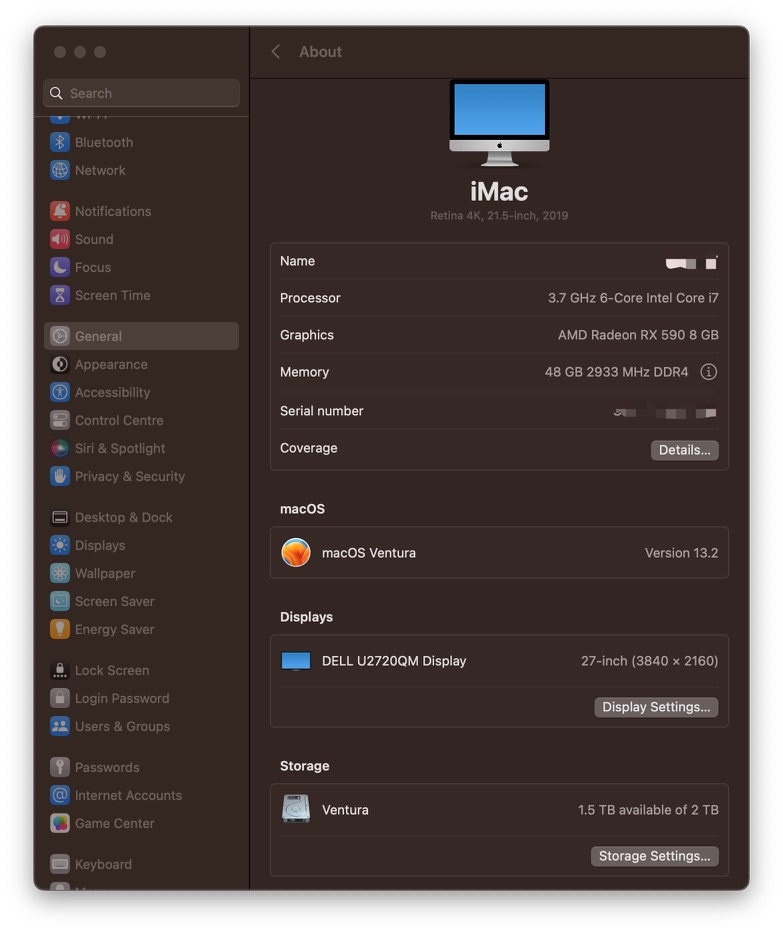
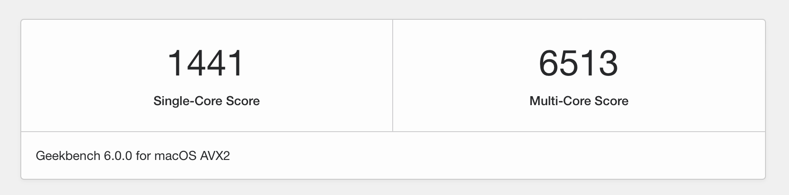
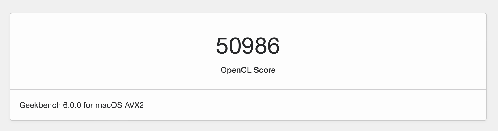

# ASUS-Z370-F-i7-8700K-macOS

https://github.com/0xHJK/ASUS-Z370-F-i7-8700K-macOS

Hackintosh 华硕Z370-F黑苹果EFI配置和教程，根据不同需求选择不同的EFI

* macOS Ventura 13.2（基于OpenCore，推荐）
* macOS Big Sur 11.1（基于OpenCore）
* macOS Catalina 10.15（基于Clover）
* macOS Mojave 10.14 （基于Clover）

## 配置信息

- ✅ 主板：ASUS ROG STRIX Z370-F GAMING
- ✅ CPU：Intel i7 8700K
- ✅ 显卡：蓝宝石RX590 8G D5 超白金极光特别版
- ✅ 内存：
   - 金士顿骇客神条 Predator DDR4 2933 8G * 2 
   - 芝奇幻光戟 DDR4 3200 16G * 2 https://u.jd.com/Kstvzhb
- ✅ 以太网卡：Intel I219V2 PCI Express Gigabit Ethernet（主板自带）
- ✅ 无线网卡&蓝牙：BCM943602CS（另购）
- ✅ 存储：SanDisk Ultra 3D NVMe 2T 至尊高速系列 https://u.jd.com/KstvDTr
- ✅ 显示器：DELL U2720QM
- ✅ USB、Audio、AirDrop、AppStore、Messages、AirPlay

## 跑分情况







## 安装说明

详细安装说明（基于Clover）：https://mp.weixin.qq.com/s/KOZiXMBKx13EYeQrAn7E5g

详细安装说明（基于OpenCore）：https://dortania.github.io/getting-started/

公众号：黑星实验室

QQ黑苹果一群：980197002（已满）

QQ黑苹果二群：1036366410

XPS 13 传送门：https://github.com/0xHJK/XPS13-9360-i5-8250U-macOS

## 主要步骤

1. 找一台运行macOS的电脑，在App Store里面搜索下载目标版本的macOS系统
   - macOS 13 Ventura https://apps.apple.com/cn/app/macos-ventura/id1638787999?mt=12
   - macOS 12 Monterey https://apps.apple.com/cn/app/macos-monterey/id1576738294?mt=12
   - macOS 11 Big Sur https://apps.apple.com/cn/app/macos-big-sur/id1526878132?mt=12
2. 准备一个U盘，格式化U盘，使用命令行将系统写入到U盘

```bash
sudo /Applications/Install\ macOS\ Ventura.app/Contents/Resources/createinstallmedia --volume /Volumes/USB
```

3. 使用 `MountEFI` 挂载U盘中的EFI分区，使用本项目的对应的EFI替换U盘中的EFI
4. 修改配置中的序列号，如MLB、SystemSerialNumber、SystemUUID等
5. 使用 `USBMap` 匹配USB接口信息，生成USBMap.kext并替换
6. 设置BIOS
   - 关闭**VT-d**
   - 关闭**CFG-Lock**
   - 关闭**Secure Boot Mode**
   - 选择系统类型为 **Other OS**
   - 关闭**IO Serial Port**

7. 使用U盘启动电脑
8. 使用磁盘工具格式化目标硬盘
9. 将macOS安装到目标硬盘（会有多次重启）
10. 成功安装macOS后，U盘中的EFI文件复制到硬盘中的EFI，使用 `Hackintool` 等工具进行适配调整
